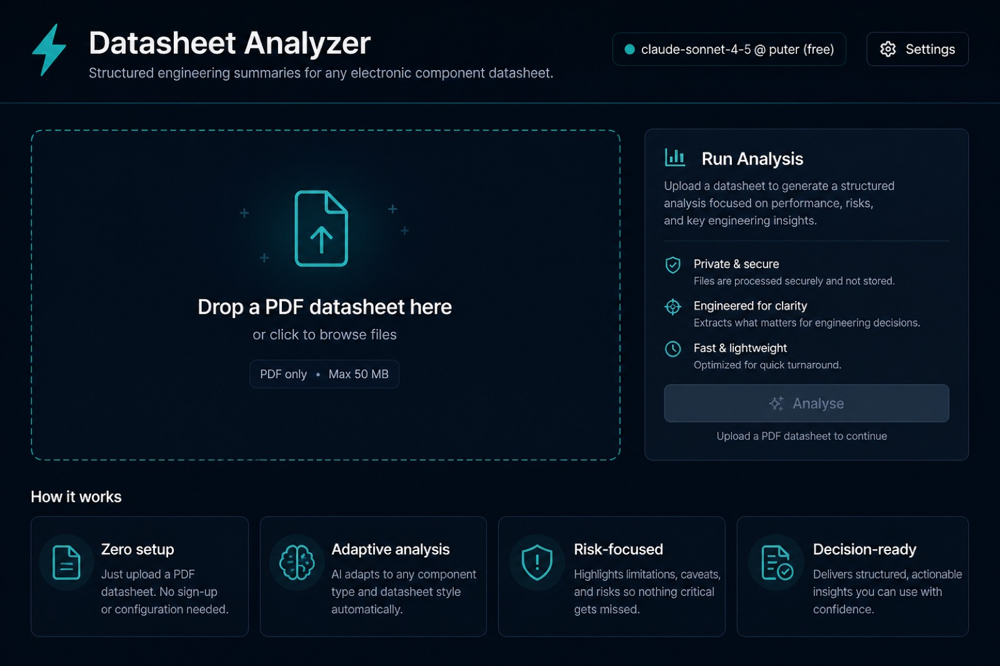
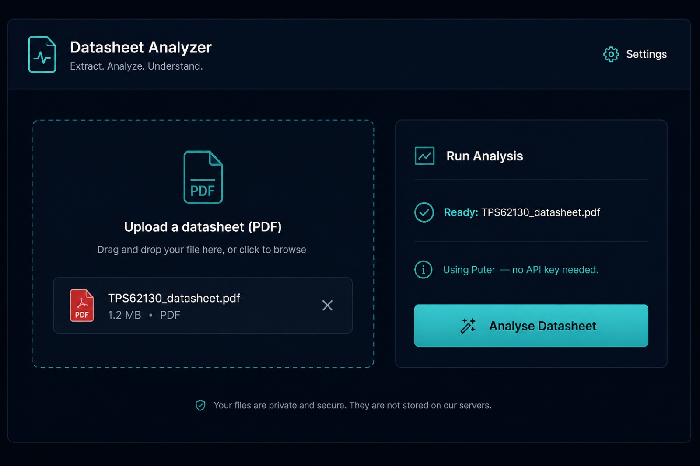
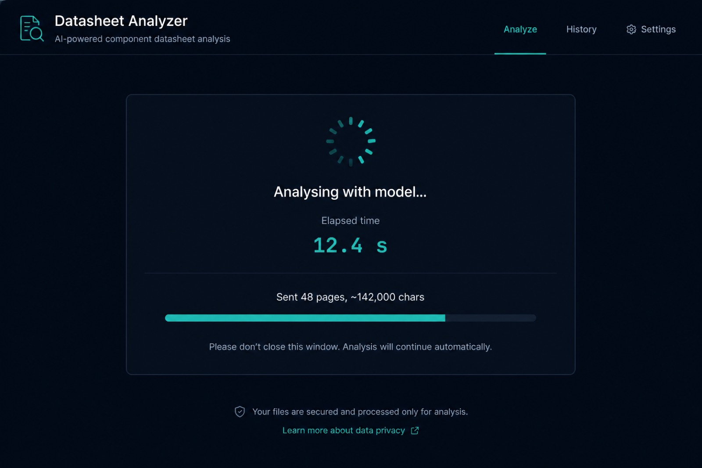
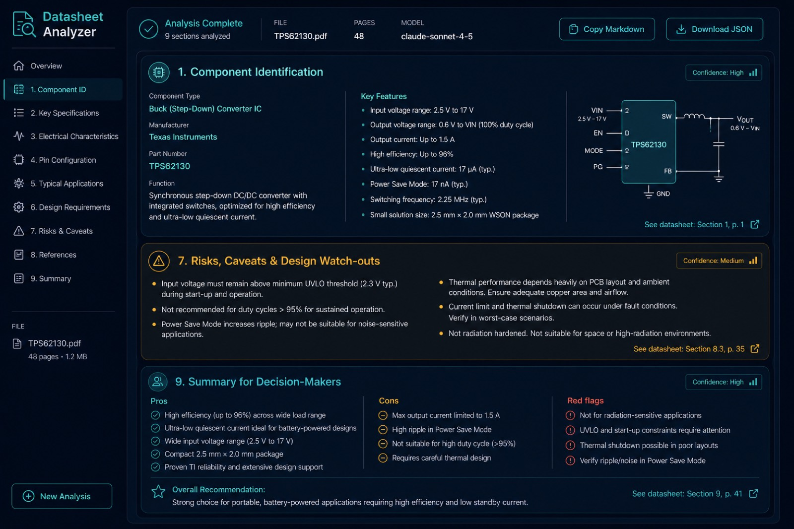

# 📄 AI Datasheet Analyzer

> Turn any electronic component datasheet into a **risk-first engineering summary** — adaptive sections, bring-up watch-outs, and decision-ready pros / cons / red flags.

<br>

<p align="center">
  
  
  
  
</p>

<p align="center">
  <b>Author:</b> Arshia Keshvari (<code>@TeslaNeuro</code>)
  &nbsp;·&nbsp;
  <b>License:</b> <a href="./LICENSE">MIT</a>
</p>

<br>

## 🎯 What it does

Drop in a PDF datasheet. The app extracts text **locally in your browser**, then asks an LLM to produce a structured summary written like an experienced electronics engineer — focused on risk, bring-up, and design watch-outs.

Output adapts to the part: IC, sensor, power device, connector, module, equipment, and more. Irrelevant sections are omitted; component-specific extras can appear when they matter.

<br>

## ✨ Features

| | |
| :--- | :--- |
| 🆓 **Zero-setup default** | Runs on [Puter.js](https://docs.puter.com/AI/chat/) — no API key, no server. First analysis signs into a free Puter account; users pay only for their own usage. |
| 🦙 **Local / private mode** | One-click [Ollama](https://ollama.com) preset. Models stay on your machine. |
| 🔑 **Bring your own key** | OpenAI, OpenRouter, or any OpenAI-compatible endpoint (Groq, Together, vLLM, LM Studio, …). Key stays in `localStorage`. |
| 📕 **Local PDF parsing** | [`pdfjs-dist`](https://github.com/mozilla/pdfjs-dist) in the browser. The file never leaves your machine — only extracted text is sent to the model. |
| 🧩 **Adaptive sections** | Pinout, curves, etc. appear only when relevant; custom extra sections for sensors, SMPS, connectors, and more. |
| ⚠️ **Risk-first** | *Risks & design watch-outs* and *Decision summary* are always present, with explicit red flags. |
| 📤 **Exports** | Copy or download as Markdown or JSON. |
| 🪶 **No backend** | Pure static SPA — host anywhere. |

<br>

## 🧱 Output structure

Nine adaptive sections (omit what doesn’t apply; add extras when useful):

| # | Section | When |
| :-: | :--- | :--- |
| 1 | Component Identification | Always |
| 2 | Absolute Maximum Ratings | If applicable |
| 3 | Recommended Operating Conditions | If applicable |
| 4 | Electrical / Performance Characteristics | If applicable |
| 5 | Pinout / Interface / Connections | If applicable |
| 6 | Recommended Circuits / Application Notes | If applicable |
| 7 | Risks, Caveats & Design Watch-outs | **Always** |
| 8 | Alternatives & Cross-References | If known |
| 9 | Summary for Decision-Makers | **Always** (pros · cons · red flags) |

Examples of model-added extras: *Calibration* (sensor), *Safety / Isolation* (SMPS), *Mating / IP rating* (connector).

<br>

## 🚀 Quick start

```bash
npm install
npm run dev
```

Open [http://localhost:5173](http://localhost:5173) → drop a PDF → **Analyse**.

The first Puter call opens a sign-in popup; later runs are silent.

<br>

## 🖼️ Workflow guide

Four steps from empty screen to a decision-ready summary:

### 1️⃣ Upload a datasheet

Drag a PDF into the dropzone (or click to browse). Nothing is uploaded to an app server — parsing stays in your browser.

<p align="center">
  
</p>

### 2️⃣ Confirm & analyse

With a file selected, click **Analyse Datasheet**. Use **Settings** first if you want Ollama, OpenAI, OpenRouter, or a custom endpoint instead of Puter.

<p align="center">
  
</p>

### 3️⃣ Watch extraction & analysis

The app extracts text page-by-page, then streams the model response. You can cancel anytime.

<p align="center">
  
</p>

### 4️⃣ Review results & export

Browse adaptive sections (identification, ratings, risks, decision summary, …). Copy or download as **Markdown** or **JSON**.

<p align="center">
  
</p>

<br>

## 🔁 Providers

Open **Settings** to switch providers:

| Provider | Key? | Suggested models | Notes |
| :--- | :-: | :--- | :--- |
| **Puter** | No | `claude-sonnet-4-5`, `gpt-5.4-nano`, `gpt-5.2-chat`, `gemini-2.5-flash` | Keyless; user-pays via Puter |
| **Ollama** | No | `qwen3.6:27b`, `gemma4:12b`, `qwen3-coder:30b`, `llama3.3` | 100% local — see CORS below |
| **OpenAI** | Yes | `gpt-5.6-luna`, `gpt-5.6-terra`, `gpt-5.4-nano` | Bring your own key |
| **OpenRouter** | Yes | `anthropic/claude-sonnet-4.5`, `google/gemini-2.5-flash`, `openai/gpt-5.4-nano` | One key, many models |
| **Custom** | Yes | Any OpenAI-compatible model | Groq, Together, vLLM, LM Studio, … |

Prefer models that support JSON mode (`response_format: json_object`). Puter routes may not always honour it, so the prompt also demands a single JSON object and the parser recovers JSON from prose when needed.

<br>

## 🦙 Ollama (local, free, private)

**1. Install & pull a model**

```bash
ollama pull qwen3.6:27b
```

Models in the **~12B+** range (or strong MoE equivalents) work best for structured extraction. Smaller 3–8B models often skip required JSON fields.

| Tier | Models | Rough fit |
| :--- | :--- | :--- |
| **Recommended** | `qwen3.6:27b`, `gemma4:12b` | Best balance for datasheet JSON |
| **Coding / long context** | `qwen3-coder:30b`, `gpt-oss:20b` | Strong instruction following on 16–24 GB cards |
| **Larger rigs** | `llama3.3:70b`, `gemma4:31b` | Higher quality when VRAM allows |
| **Light / fallback** | `qwen3:8b`, `phi4-mini` | Faster, but more incomplete JSON |

**2. Enable CORS** so the browser can call Ollama (`OLLAMA_ORIGINS` before starting Ollama):

| OS | Setup |
| :--- | :--- |
| **macOS** | `launchctl setenv OLLAMA_ORIGINS "*"` → quit & reopen the Ollama menu-bar app |
| **Linux** | `sudo systemctl edit ollama.service` → add `Environment="OLLAMA_ORIGINS=*"` → `systemctl restart ollama` |
| **Windows** | System env var `OLLAMA_ORIGINS=*` → restart Ollama |

Tighter option: `OLLAMA_ORIGINS=http://localhost:5173,http://localhost:4173`.

**3. In the app** → **Settings → Ollama (local)** → confirm base URL (`http://localhost:11434/v1`) → pick model → Save.

<br>

## 🏗️ Production build

```bash
npm run build
npm run preview
```

`dist/` is a fully static SPA — host on GitHub Pages, Netlify, Cloudflare Pages, S3, or any static host.

<br>

## 🔐 Privacy

- PDFs are parsed **in your browser**.
- There is **no app backend**. Extracted text goes straight from the browser to your chosen provider:
  - **Puter** → Puter’s API → underlying model vendor
  - **BYOK / Ollama** → your configured endpoint; API keys live only in `localStorage`

<br>

## ⚠️ Limits

| Topic | Detail |
| :--- | :--- |
| Large PDFs | ~180 000 characters max; UI flags truncation and the model notes assumptions |
| Scanned PDFs | Image-only files yield no text — OCR first or use a text-based datasheet |
| Safety-critical use | Always cross-check against the original datasheet |

<br>

## 🧰 Tech stack

```
Vite · React · TypeScript · Tailwind CSS
pdfjs-dist · react-markdown · remark-gfm
Puter.js v2 · OpenAI-compatible chat completions
```

<br>

## 📁 Project layout

```
docs/screenshots/           # Workflow guide images for this README
src/
├── App.tsx                 # Upload → extract → analyse → results
├── components/             # Dropzone, Settings, Results, UI chrome
└── lib/
    ├── pdf.ts              # Local PDF text extraction + hashing
    ├── llm.ts              # Puter / OpenAI-compatible client
    ├── prompt.ts           # Risk-first system & user prompts
    ├── cache.ts            # IndexedDB extraction & analysis cache
    └── …                   # Types, storage, export, error logging
```

<br>

## 👤 Author

**Arshia Keshvari** (`@TeslaNeuro`)

Created and maintained as an open-source tool for electronics engineers who want faster, safer datasheet triage.

<br>

## 📜 License

Released under the **[MIT License](./LICENSE)**.

Copyright © 2026 Arshia Keshvari (`@TeslaNeuro`)
